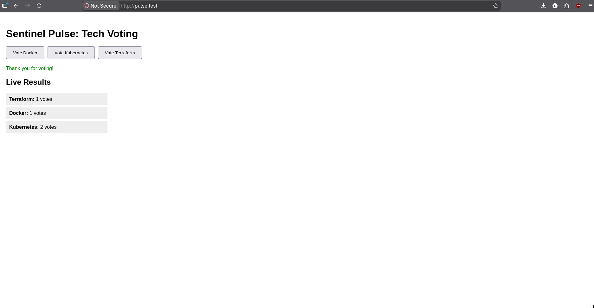
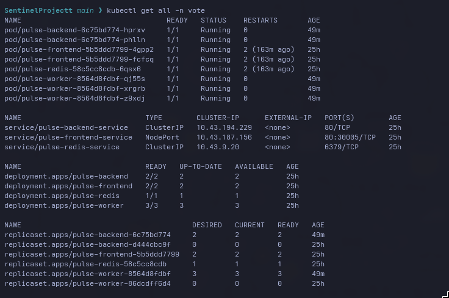
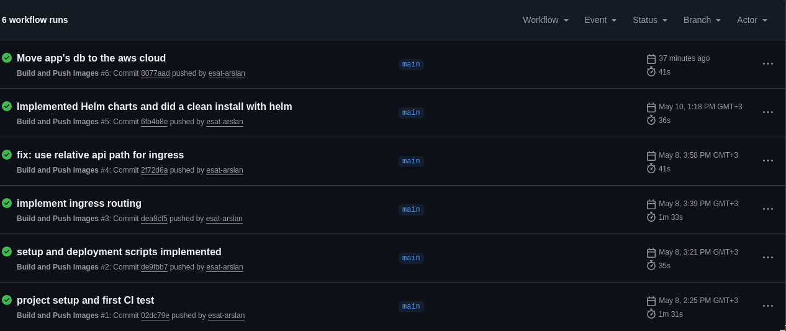
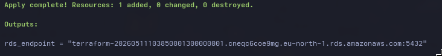
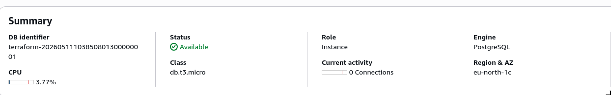

#### **1. The App UI**

*Live results showing the full stack (Frontend -> Backend -> Redis -> Worker -> AWS RDS) is functional.*

#### **2. Kubernetes Orchestration**

*All microservices running with replicas and proper service discovery in the `vote` namespace.*

#### **3. CI/CD Automation**

*Automated builds and pushes to GHCR using GitHub Actions.*

#### **4. Infrastructure as Code (Terraform)**

*Provisioning the Cloud Network and Database with a single command.*

#### **5. Managed Cloud Database (AWS RDS)**

*The production database running in AWS Stockholm (eu-north-1).*

---

### **Completed:**

1.  **The Code:** Built a multi-service app with a **FastAPI (Python)** backend, **React** frontend, and a background **Worker** to process votes through **Redis** and **Postgres**.
2.  **Containerization:** Wrote custom **Dockerfiles** for every service, using multi-stage builds and non-root users.
3.  **Local Orchestration:** Used **Docker Compose** to link all 5 containers on my machine.
4.  **Kubernetes Migration:** Moved the stack to **K8s**. Set up Deployments, Services, PVCs, and Secrets.
5.  **Networking & Ingress:** Set up a **Traefik/Nginx Ingress** controller. The app is live at `http://pulse.test` with path-based routing.
6.  **CI/CD Automation:** Created **GitHub Actions** to build and push images to **GHCR** automatically.
7.  **Helm Packaging:** Bundled everything into a **Helm Chart**. Deployment is now a single command: `helm install`.
8.  **Infrastructure as Code (IaC):** Used **Terraform** to provision a VPC and an **AWS RDS** Postgres instance.
9.  **Cloud Migration:** Migrated the app's state from a local container to the AWS Cloud.

---

### **How to Run it**

**1. Infrastructure:**
```bash
cd terraform && terraform apply
```

**2. App Deployment:**
```bash
# Set your RDS endpoint in values.yaml
helm install pulse ./sentinel -n vote --create-namespace
```

---

### Planned **

*   **Go Full Cloud:** Move compute to **AWS EKS** (Managed Kubernetes) via Terraform.
*   **GitOps:** Implement **ArgoCD** for automated deployments.
*   **Observability:** Set up **Prometheus and Grafana** for real-time monitoring.

