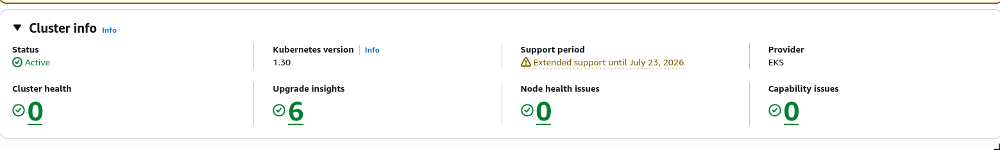
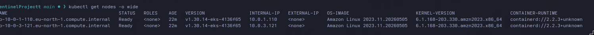
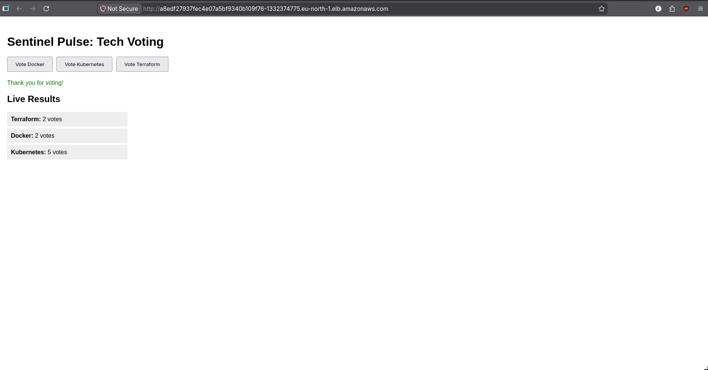

### **Project Evolution & Proof of Work**

#### **Phase 3: Full Cloud Native (AWS EKS)**
*In this final stage, I migrated the entire environment to the cloud. Both the application compute (EKS) and the database (RDS) are managed by AWS.*

**1. Global Entrypoint (AWS Load Balancer)**

*The Nginx Ingress Controller automatically provisioned a public AWS Classic Load Balancer (ELB).*

**2. Managed Control Plane (AWS EKS)**

*A production-ready EKS cluster provisioned via Terraform with Managed Node Groups.*

**3. Cloud Nodes (EC2 Worker Nodes)**

*Verification of EC2 worker nodes running Amazon Linux, successfully joined to the EKS cluster.*

**4. Public Application UI**

*The application is live and accessible globally via the AWS Load Balancer DNS name.*

---

#### **Phase 2: Hybrid Cloud (Local K8s + AWS RDS)**
*This phase shows the transition where I moved the stateful database to the cloud while keeping the compute local for development and testing.*

**1. Local App UI**

*The app running locally but connecting to a remote AWS RDS instance.*

**2. Local Kubernetes Orchestration**

*Microservices running in a local cluster with proper service discovery and multi-container architecture.*

**3. CI/CD Automation**

*Automated builds and pushes to GHCR using GitHub Actions, serving both local and cloud environments.*

**4. Infrastructure as Code (Terraform)**

*Provisioning the Cloud Network and Database with a single command.*

**5. Managed Cloud Database (AWS RDS)**

*The production database running in AWS Stockholm (eu-north-1), shared between Phase 2 and Phase 3.*

---

### **What I accomplished (in order):**

1.  **The Code:** Built a multi-service app with a **FastAPI (Python)** backend, **React** frontend, and a background **Worker** to process votes through **Redis** and **Postgres**.
2.  **Containerization:** Wrote custom **Dockerfiles** for every service, using multi-stage builds and non-root users.
3.  **Local Orchestration:** Used **Docker Compose** to link all 5 containers on my machine.
4.  **Kubernetes Migration:** Moved the stack to **K8s**. Set up Deployments, Services, PVCs, and Secrets.
5.  **Networking & Ingress:** Set up a **Traefik/Nginx Ingress** controller. The app is live at `http://pulse.test` with path-based routing.
6.  **CI/CD Automation:** Created **GitHub Actions** to build and push images to **GHCR** automatically.
7.  **Helm Packaging:** Bundled everything into a **Helm Chart**. Deployment is now a single command: `helm install`.
8.  **Infrastructure as Code (IaC):** Used **Terraform** to provision a VPC and an **AWS RDS** Postgres instance.
9.  **Cloud Migration (Hybrid):** Migrated the app's state from a local container to the AWS Cloud.
10. **Full Cloud Native (EKS):** Provisioned a managed **AWS EKS** cluster via Terraform and deployed the full stack to a global cloud environment.

---

### **How to Run it**

**1. Infrastructure:**
```bash
cd terraform && terraform apply
```

**2. App Deployment:**
```bash
# Update kubeconfig to point to EKS
aws eks update-kubeconfig --region eu-north-1 --name pulse-eks

# Deploy the Helm chart
helm upgrade --install pulse ./sentinel -n vote --create-namespace
```

---

### **What's Next?**

*   **GitOps:** Implement **ArgoCD** for automated deployments and drift detection.
*   **Observability:** Set up **Prometheus and Grafana** for real-time monitoring of cluster health.
*   **DevSecOps:** Integrate **Trivy** or **Snyk** into the CI/CD pipeline for automated vulnerability scanning.

